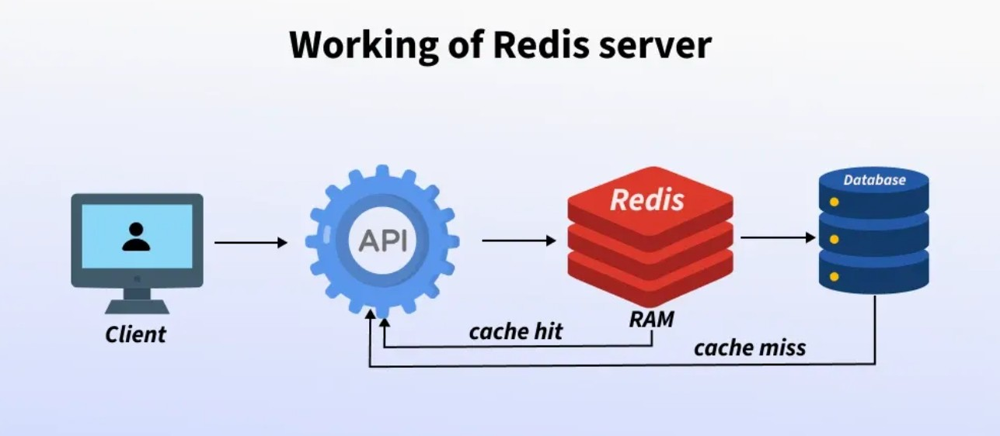

# FastAPI Redis Microservice

*Redis is commonly used as an in-memory cache placed between an API and a database to speed up responses by serving frequently accessed data directly from memory*



## Content
A minimal FastAPI microservice using Redis for state/cache management, containerized with Docker and deployable on Kubernetes.

The API exposes a counter endpoint, while Redis is used to store and update the counter value across requests.

This simple setup serves as a base to illustrate common patterns such as externalized state, caching, and shared data across services.

In practice, this pattern is commonly used for request counters, rate limiting, or shared session state in distributed systems.


## Directory Structure

```
fastapi-redis-demo/
├─ app/
│  ├─ main.py              # FastAPI API
│  ├─ requirements.txt     # Python dependencies
│  └─ Dockerfile           # API image
├─ docker-compose.yml      # Local orchestration
├─ k8s/                    # Kubernetes manifests
│  ├─ namespace.yaml
│  ├─ redis-deployment.yaml
│  ├─ redis-service.yaml
│  ├─ api-deployment.yaml
│  └─ api-service.yaml
└─ README.md
```

## Local Execution with Docker Compose
```bash
docker compose up --build
```
Test: http://localhost:8000/ping

Each call increments the counter:
```json
{"status": "ok", "hits": 1}
```

## Build & Push Docker Image
```bash
docker build -t alexandremathiasdonnat/fastapi-redis-demo:latest ./app
docker push alexandremathiasdonnat/fastapi-redis-demo:latest
```

## Kubernetes Deployment
Enable Kubernetes (Docker Desktop or Minikube)

Apply the manifests:
```bash
kubectl apply -f k8s/
kubectl -n demo get pods,svc
```
---
**Alexandre Mathias DONNAT, Sr**