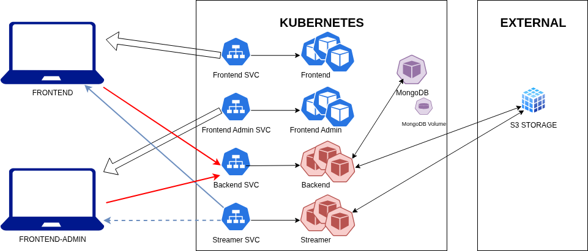

#  Ginflix - A Mini Netflix Dockerized Deployed on Kubernetes

**Microservice architecture, Kubernetes, DevOps, cloud computing, multimedia streaming, Scaling**

Ginflix is a full-stack web application inspired by Netflix, fully deployed on Kubernetes using Kind (K8s in docker).  
It demonstrates how to design and deploy a containerized microservice architecture, including user and admin frontends, a backend API, a video streaming service, and a persistent MongoDB database.


##  Project Objective

This project was developed as part of the *Cloud & Kubernetes* course.  
The goal was to:

- Deploy a multi-container application inside a local Kubernetes cluster.  
- Manage configuration, persistence, and inter-service communication.  
- Master the main Kubernetes objects:  
  **Namespace**, **Deployments**, **Services**, **ConfigMap**, **Secrets**, and **StatefulSet**.


## Global Architecture

The full architecture is composed of five main services:

| Service | Description | Kubernetes Object |
|----------|-------------|-------------------|
|  `frontend` | User interface | Deployment + NodePort Service |
|  `frontend-admin` | Admin panel for video upload | Deployment + NodePort Service |
|  `backend` | REST API | Deployment + NodePort Service |
|  `streamer` | Video transcoding via FFmpeg | Deployment + NodePort Service |
|  `mongo` | Persistent database | StatefulSet + ClusterIP Service |

All services run under the **`ginflix` namespace**, and communicate through Kubernetes DNS (`.svc.cluster.local`).




## Technology Stack

| Component | Technology |
|------------|-------------|
| Containerization | Docker |
| Orchestration | Kubernetes (Kind) |
| Database | MongoDB |
| Video Processing | FFmpeg |
| Frontend | Nginx + HTML/JS |
| Backend | REST API (Go or Node.js depending on the image) |
| Configuration & Secrets | ConfigMap / Secret |


##  Repository Structure
```
Ginflix/
├── ginflix-k8s/                # Kubernetes manifests
│   ├── backend/                # Backend API
│   ├── streamer/               # Streaming service
│   ├── frontend/               # User interface
│   ├── frontend-admin/         # Admin upload interface
│   ├── mongo/                  # MongoDB (StatefulSet + PVC)
│   ├── config/                 # ConfigMap + Secrets
│   ├── kind-config.yaml        # Kind cluster configuration
│   └── ns.yaml                 # Namespace definition
└── README.md
```

>  The Docker images (`ginflix-backend.tar`, `ginflix-streamer.tar`, etc.)  
> are **available on request** and can be loaded manually using:
> ```bash
> docker load -i ginflix-backend.tar
> docker load -i ginflix-streamer.tar
> docker load -i ginflix-frontend.tar
> docker load -i ginflix-frontend-admin.tar
> ```


## Local Deployment

###  Prerequisites
- Docker  
- Kind  
- Kubectl  

### Create the Kind Cluster
```bash
kind create cluster --name ginflix --config ginflix-k8s/kind-config.yaml
```

### Load Local Images
```
for f in project/ginflix/*.tar; do docker load -i "$f"; done
kind load docker-image ginflix-backend:latest --name ginflix
kind load docker-image ginflix-streamer:latest --name ginflix
kind load docker-image ginflix-frontend:latest --name ginflix
kind load docker-image ginflix-frontend-admin:latest --name ginflix
```

### Apply the Kubernetes Manifests

```
kubectl apply -f ginflix-k8s/ --recursive
kubectl get pods -n ginflix
kubectl get svc -n ginflix
```

## Accessing the Services

| Service | URL | Port |
|----------|------|------|
|  Streamer API | [http://localhost:30082](http://localhost:30082) | 30082 |
|  Backend API | [http://localhost:30081](http://localhost:30081) | 30081 |
|  Frontend | [http://localhost:30080](http://localhost:30080) | 30080 |
|  Frontend Admin | [http://localhost:30083](http://localhost:30083) | 30083 |

> The backend and streamer may return `404 Not Found` on `/` — this is normal since they expose internal routes only.

## Technical Features Implemented

- Configuration injection via **ConfigMap**  
- Sensitive data management via **Secrets**  
- Persistent storage for MongoDB with **PVC + StatefulSet**  
- Internal pod communication via **Kubernetes DNS**  
- Reproducible deployment with `kubectl apply -f`  
- External exposure via **NodePort** and Kind `extraPortMappings`  

## For Further Exploration

Additional improvements could include:
- **Horizontal Pod Autoscaling (HPA)** for dynamic load scaling  
- **Ingress** for unified access management  
- **CI/CD pipeline** with GitHub Actions or ArgoCD  
- **Resource limits and probe tuning** for production-grade stability  

## Validation Checklist

| Component | Status |
|------------|---------|
| Namespace `ginflix` | OK |
| All Pods Running | OK |
| Services Exposed (NodePort) | OK |
| Frontend ↔ Backend ↔ Streamer Communication | OK |
| MongoDB Persistence | OK |
| ConfigMap & Secrets Working | OK |

