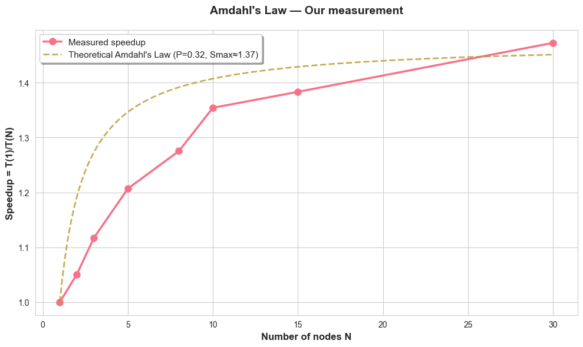
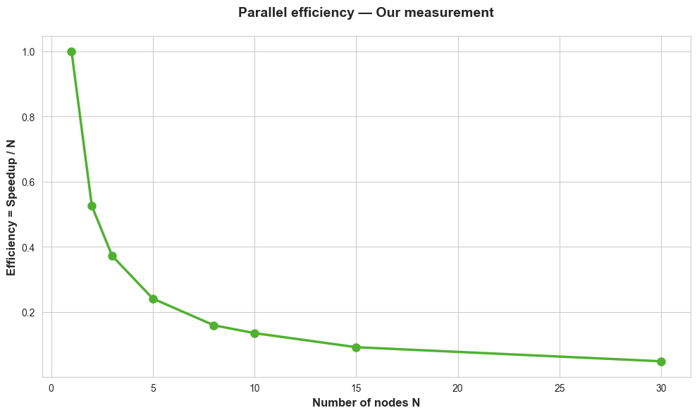

# Building a Distributed MapReduce Protocol (from Scratch)

## About

> A fully custom MapReduce engine built from scratch using Python sockets (TCP).  
> Designed and deployed on a distributed Linux cluster (Telecom Paris).  
> Implements WordCount and Distributed Sort pipelines to validate Amdahl's Law empirically.

## What is MapReduce ?

MapReduce is a parallel computation model used in distributed systems (e.g., Hadoop).  
It splits large datasets into independent chunks (splits), distributes them across multiple nodes for local processing (Map), reorganizes intermediate data (Shuffle), and merges the results (Reduce).

Although MapReduce has been largely replaced by Apache Spark and Flink, it remains a foundational concept in cluster computing and data-parallel architecture.

This repository rebuilds the entire engine from zero, no Hadoop, no framework,  using raw sockets, YAML-based job definitions, and precise time instrumentation.


## Architecture

Each computation follows the pipeline:

$$T_{total} = T_{map} + T_{shuffle} + T_{reduce}$$

where:
- $T_{map}$: time spent tokenizing and counting words in parallel,
- $T_{shuffle}$: time for key redistribution across nodes (hash partitioning),
- $T_{reduce}$: local aggregation and file writing.

### Load Balancing via Round-Robin Assignment

To distribute the workload evenly, the master uses a *round-robin scheduling policy*:

$$
\text{assigned}(i) = \{\, s_j \mid j \bmod N = i \,\}
$$

where:
- $s_j$ is the j-th data split,
- $N$ is the number of available workers,
- and $i \in \{0, \ldots, N-1\}$.

This ensures that each worker processes approximately the same number of splits, minimizing idle time.  
Round-robin is a simple yet effective deterministic load-balancing rule widely used in distributed schedulers.

The design uses an explicit master–worker protocol over TCP: Master schedules splits, tracks node availability, and collects timings. Then workers perform Map, Shuffle, Reduce, and Sort steps as commanded. Finally the communication uses serialized Python objects (`pickle`) with custom framing.

## System Components

| File | Role |
|------|------|
| `MapReduce/src/master.py` | Supervises all phases (Map / Shuffle / Reduce / Sort). Implements round-robin distribution and performance logging. |
| `MapReduce/src/worker.py` | Executes Map / Reduce / Sort operations on each node via socket requests. |
| `MapReduce/src/mapper_wc.py` | Word tokenization and counting (core of WordCount). |
| `MapReduce/src/net.py` | TCP serialization utilities (`send_obj`, `recv_obj`). |
| `MapReduce/src/metrics.py` | Timer-based instrumentation for Amdahl analysis. |
| `MapReduce/tools/multi_split.py` | Splits large WET files into homogeneous chunks (16 MiB). |
| `scripts_local/job_wordcount.yaml` | WordCount job definition (Map + Shuffle + Reduce). |
| `scripts_local/job_sort.yaml` | Distributed sort by frequency and lexicographic order. |
| `scripts_local/run_campaign.sh` | Automates multi-node runs for Amdahl's Law (N = 1–30). |

## Experimental Setup

Data volume: 480 MiB (30 × 16 MiB splits)  
Distribution: round-robin, ensuring fixed workload while increasing node count  
Tested nodes: N = 1, 2, 3, 5, 8, 10, 15, 30 (virtual machines provided by Telecom Paris) 

Environment: Linux (Ubuntu), Python 3.11  
Networking: custom TCP connections, one socket per worker

### Theoretical Background – Amdahl's Law

Amdahl's Law models the theoretical upper bound of parallel speedup.  
It assumes that only a fraction $P$ of a program can be parallelized, while the remaining fraction $(1-P)$ must be executed sequentially.

The total execution time for $N$ parallel workers is:

$$T_N = T_1 \times \left( (1 - P) + \frac{P}{N} \right)$$

Hence, the *speedup* is bounded by:

$$S(N) = \frac{T_1}{T_N} \leq \frac{1}{(1 - P) + \frac{P}{N}}$$

As $N \to \infty$, the speedup tends to $1 / (1 - P)$, which explains why adding more nodes eventually gives diminishing returns.

### Mathematical objective

Empirically validate Amdahl's Law:
$$S(N) = \frac{T_1}{T_N} = \frac{1}{(1 - P) + \frac{P}{N}}$$
 
In practice, the speedup curve asymptotically plateaus as shuffle overhead dominates.

## Results

Total runtime $T_{total}$ decreases monotonically with N.  
Speedup saturates around 10 nodes, confirming Amdahl's limit.  
The shuffle phase becomes dominant beyond N ≈ 10.  
All timing results are logged in `experiments/run.csv`.




## Distributed Sort (Phase 2)

After WordCount aggregation, a second MapReduce performs a global sort:

Each worker sorts its local shard by `(-count, word)` (`SORT_LOCAL` event).  

The master merges sorted subsets via k-way merge:
```python
def kway_merge_sorted_lists(list_of_lists):
# Maintains global order (-count, word)
```

### Hash Partitioning during Shuffle

During Phase 1b, each intermediate key (word) is sent to a worker according to a *modular hash function*:

$$h(w) = \text{hash}(w) \bmod N$$

This ensures a deterministic and balanced distribution of keys:  
- All occurrences of the same word $w$ are sent to the same worker $h(w)$.  
- The expected load per node is uniform, assuming a random key distribution.

Such hash-based partitioning is the mathematical foundation of the Shuffle phase in MapReduce, guaranteeing that the Reduce stage operates on complete key groups.


## Quick Start

### Start a local worker
```bash
python3 MapReduce/src/worker.py --port 5001 --root /tmp/bigmap/worker &
```

### Run WordCount (Phase 1b)
```bash
python3 MapReduce/src/master.py \
    --job scripts_local/job_wordcount.yaml \
    --nodes scripts_local/nodes.txt
```

### Run Distributed Sort (Phase 2)
```bash
python3 MapReduce/src/master.py \
    --job scripts_local/job_sort.yaml \
    --nodes scripts_local/nodes.txt
```

### Full Campaign (Amdahl)
```bash
bash scripts_local/run_campaign.sh
```

## Repository Tree

```
bigdata-mapreduce/
├── MapReduce/
│   ├── src/ (master, worker, net, mapper_wc, metrics)
│   └── tools/ (multi_split, split_input)
├── scripts_local/ (YAML configs + campaign)
├── experiments/run.csv
├── splits_16M_30/
└── others/ (report, png, txt)
```

## References

Jeffrey Dean & Sanjay Ghemawat (2004). "MapReduce: Simplified Data Processing on Large Clusters."

Amdahl, G. M. (1967). "Validity of the Single Processor Approach to Achieving Large-Scale Computing Capabilities."

## Author

Alexandre Mathias Donnat, Sr
